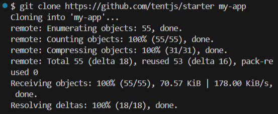
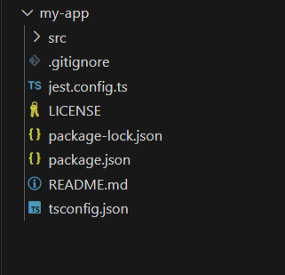
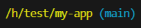
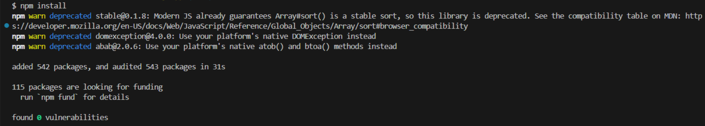
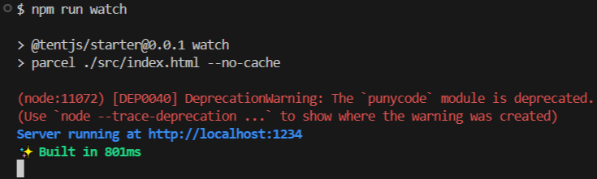
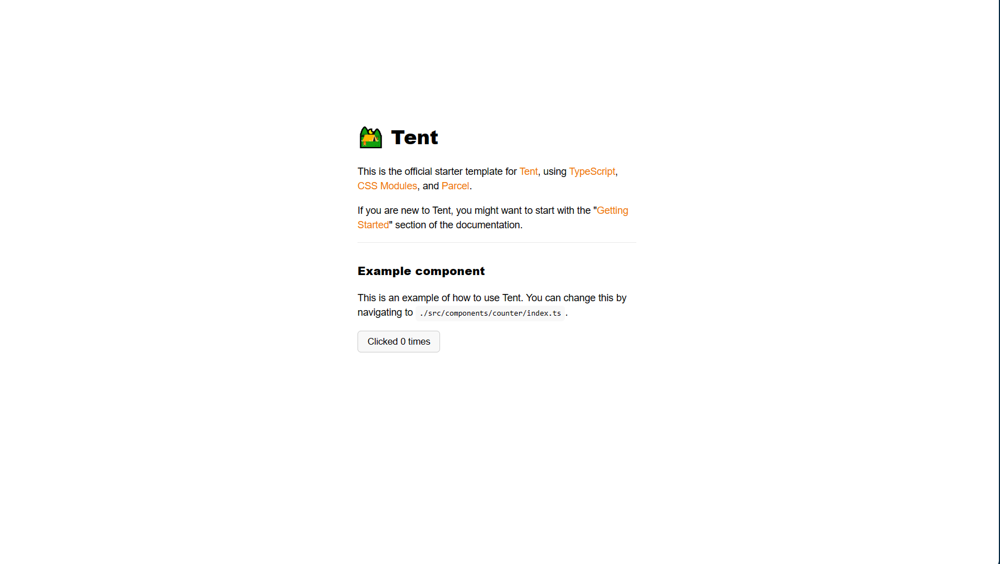

# Starter

The official starter template for ⛺ Tent.

## Features

- [TypeScript](https://www.typescriptlang.org/)
- [CSS Modules](https://github.com/css-modules/css-modules)
- [Parcel](https://parceljs.org/)
- [Jest](https://jestjs.io/)

## Usage

```bash
git clone @tentjs/starter my-app
cd my-app
npm install
npm run watch
```

## Running the Development Server (with Example)

### 1. Clone the starter project:
```bash
git clone https://github.com/tentjs/starter my-app
```


#### Following hierarchy will be created:


### 2. Navigate to the project directory:
```bash
cd my-app
```


### 3. Install dependencies:
```bash
npm install
```


### 4. Start the development server:
```bash
npm run watch
```


#### Server running at local host
